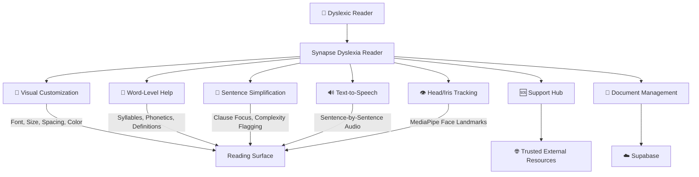
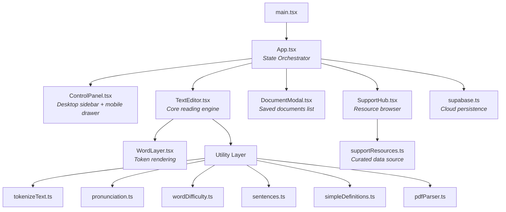
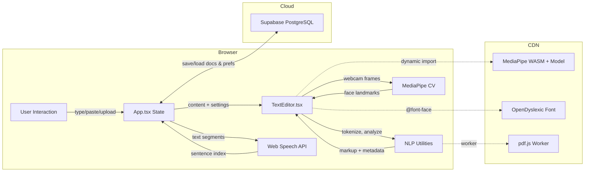
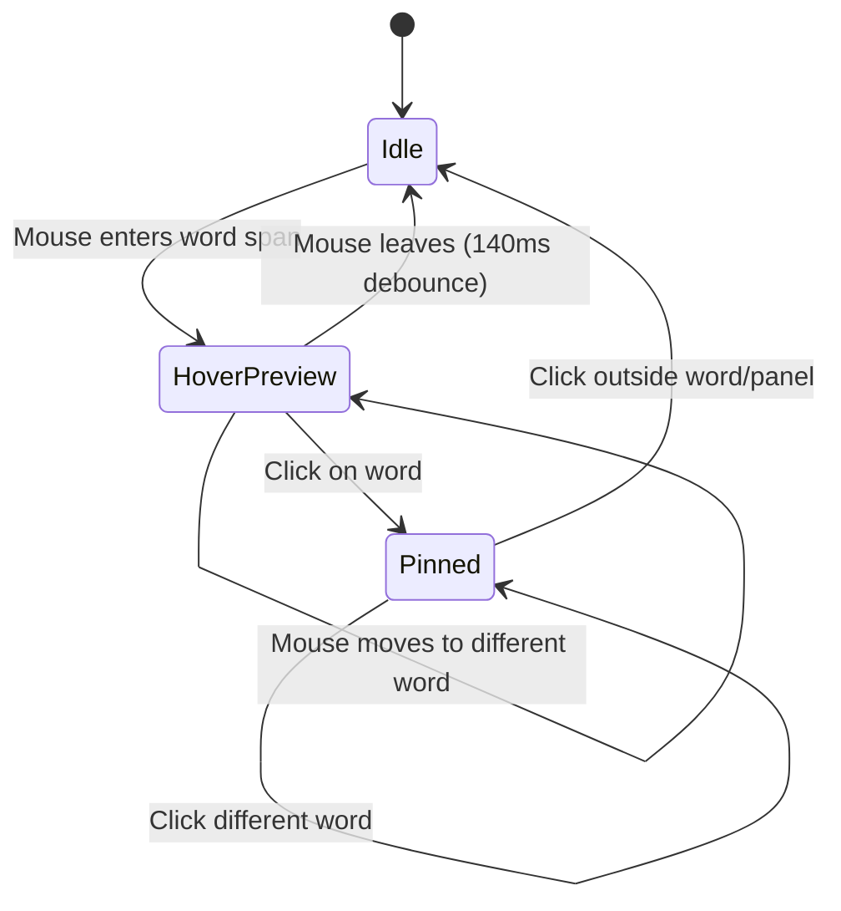
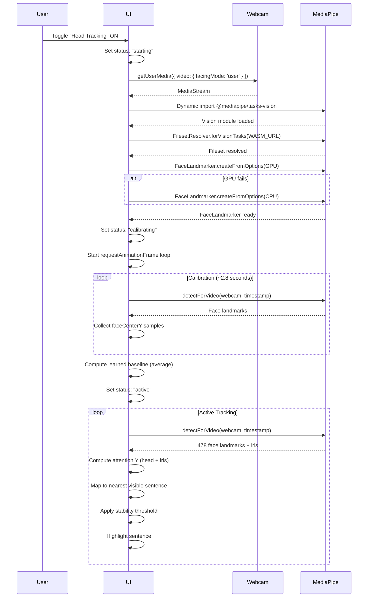
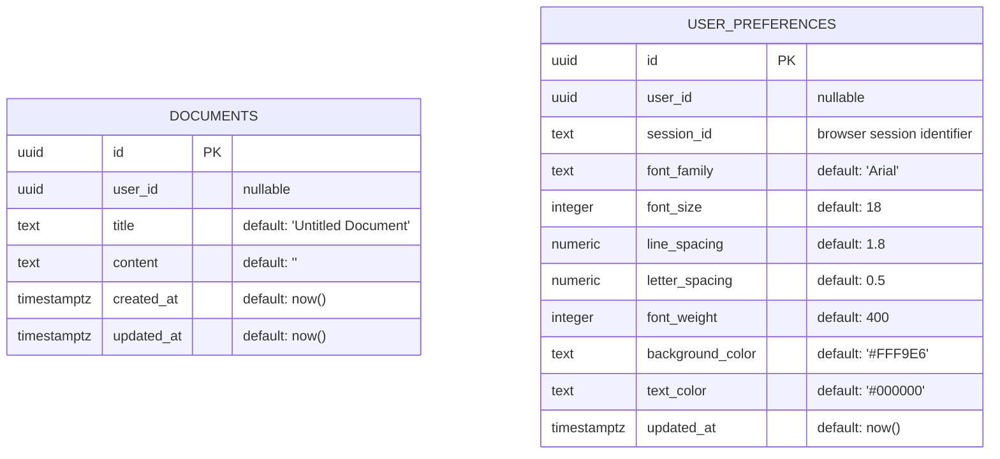

# Synapse Dyslexia Reader — Complete Project Analysis

> **Project Name:** Synapse Dyslexia Reader (Custom Dyslexia Reader Development)  
> **Repository:** `ArpitKumarpy/Dyslexia`  
> **Analysis Date:** 2026-04-06  

---

## Table of Contents

1. [Executive Summary](#1-executive-summary)
2. [Problem Domain](#2-problem-domain)
3. [Solution Overview](#3-solution-overview)
4. [Technology Stack](#4-technology-stack)
5. [Project Structure](#5-project-structure)
6. [Architecture & Data Flow](#6-architecture--data-flow)
7. [Feature Subsystems — Deep Dive](#7-feature-subsystems--deep-dive)
   - 7.1 [Visual Customization Engine](#71-visual-customization-engine)
   - 7.2 [Word-Level Help System](#72-word-level-help-system)
   - 7.3 [Sentence-Level Reading Support](#73-sentence-level-reading-support)
   - 7.4 [Text-to-Speech (Read Aloud)](#74-text-to-speech-read-aloud)
   - 7.5 [PDF Import](#75-pdf-import)
   - 7.6 [Head & Iris Tracking](#76-head--iris-tracking)
   - 7.7 [Curated Support Hub](#77-curated-support-hub)
8. [NLP & Computer Vision Techniques](#8-nlp--computer-vision-techniques)
9. [Database & Persistence](#9-database--persistence)
10. [UI/UX Design Philosophy](#10-uiux-design-philosophy)
11. [Deployment & DevOps](#11-deployment--devops)
12. [Security Posture](#12-security-posture)
13. [Design Decisions & Tradeoffs](#13-design-decisions--tradeoffs)
14. [Known Limitations](#14-known-limitations)
15. [Recommended Next Steps](#15-recommended-next-steps)
16. [File-by-File Reference](#16-file-by-file-reference)

---

## 1. Executive Summary

The **Synapse Dyslexia Reader** is a browser-based assistive reading workspace designed to help individuals with dyslexia read more comfortably and effectively. It is a single-page application (SPA) built with **React 18**, **TypeScript**, and **Vite**, backed by **Supabase** for cloud persistence and styled with **TailwindCSS 3**.

The application addresses reading difficulties through a layered model of assistance:

| Layer | What It Does |
|-------|-------------|
| **Visual adjustments** | Font, size, spacing, color, weight control |
| **Word-level help** | Syllable breakdown, phonetic hints, morphology, definitions |
| **Sentence-level support** | Clause splitting, complexity flagging, step-through focus |
| **Speech** | Sentence-by-sentence read-aloud with active sentence highlighting |
| **Attention guidance** | Browser-local webcam-based head + iris tracking |
| **External support** | Curated hub of trusted dyslexia resources, helplines, videos |

The application runs entirely in the browser (including all NLP and computer vision), with the sole server dependency being Supabase for document and preference persistence.

---

## 2. Problem Domain

### 2.1 What Is Dyslexia?

Dyslexia is a specific learning disability that affects an estimated **5–17%** of the global population. It primarily impacts reading fluency, word decoding, spelling, and comprehension. Crucially, dyslexia is not related to intelligence — it is a neurological difference in how the brain processes written language.

### 2.2 Core Reading Challenges

People with dyslexia frequently experience:

| Challenge | Description |
|-----------|-------------|
| **Visual crowding** | Letters and words appear to "run together" |
| **Letter reversal** | Confusing visually similar letters (b/d, p/q) |
| **Tracking difficulty** | Losing one's place on the line while reading |
| **Decoding struggle** | Difficulty sounding out unfamiliar or complex words |
| **Comprehension overload** | Long or complex sentences overwhelm working memory |
| **Glare sensitivity** | White backgrounds and high contrast cause visual stress |
| **Reading fatigue** | Extended reading is exhausting due to constant compensation |

### 2.3 Why an Assistive Reader?

Traditional reading surfaces (books, PDFs, websites) are designed for neurotypical readers. The Synapse Dyslexia Reader exists because:

- **Existing tools are fragmented** — most assistive features (font change, TTS, tracking) live in separate apps
- **Customization matters** — every dyslexic reader has different preferences; one-size-fits-all fails
- **Context-sensitive help is missing** — most readers don't explain *why* a word is hard or *how* to break it down
- **Trust matters for support resources** — random search results are risky; curated resources are safer

---

## 3. Solution Overview

The Synapse Dyslexia Reader provides an **all-in-one reading workspace** where users can:

1. **Paste or import text** (including PDF upload)
2. **Customize the visual reading surface** (font, size, spacing, color, weight)
3. **Get word-level help** by hovering/clicking any word (pronunciation breakdown, phonetic hint, morphology, definition, difficulty analysis)
4. **Simplify complex sentences** with clause-by-clause focus stepping
5. **Listen to text** with sentence-by-sentence read-aloud and active highlighting
6. **Enable a reading ruler or focus mode** to reduce visual distraction
7. **Use head/iris tracking** for hands-free reading line guidance via webcam
8. **Save and load documents** to Supabase cloud storage
9. **Access trusted support resources** (guides, videos, helplines, local organizations)
10. **Enter a distraction-free Reading Mode** that hides all controls



---

## 4. Technology Stack

### 4.1 Frontend (Core)

| Technology | Version | Purpose |
|-----------|---------|---------|
| **React** | 18.3.1 | UI component framework |
| **TypeScript** | 5.5.3 | Type-safe JavaScript |
| **Vite** | 5.4.2 | Build tool & dev server |
| **TailwindCSS** | 3.4.19 | Utility-first CSS framework |
| **PostCSS** | 8.4.35 | CSS processing pipeline |
| **Autoprefixer** | 10.4.18 | Browser compatibility for CSS |

### 4.2 Backend & Persistence

| Technology | Purpose |
|------------|---------|
| **Supabase** (hosted PostgreSQL) | Document storage, user preference persistence |
| **@supabase/supabase-js** v2.57.4 | Browser-side Supabase client |
| **Row Level Security (RLS)** | Database access control |

### 4.3 NLP & Text Processing (All Client-Side)

| Utility | Domain |
|---------|--------|
| Custom **syllable chunking** via vowel-group regex | Word pronunciation breakdown |
| Custom **phonetic heuristics** | Simplified pronunciation hints |
| Custom **morphological analysis** | Prefix/root/suffix decomposition |
| Custom **word difficulty scorer** | Multi-factor difficulty classification |
| Custom **sentence clause splitter** | Sentence simplification |
| Custom **simple definition dictionary** | Plain-language word meanings |
| Custom **text tokenizer** | Word/whitespace segmentation |

### 4.4 Computer Vision (Client-Side)

| Technology | Version | Purpose |
|-----------|---------|---------|
| **@mediapipe/tasks-vision** | 0.10.34 | Face landmark detection (478 landmarks + iris) |
| **MediaPipe Face Landmarker model** | float16 v1 | Pre-trained face mesh model |
| **WebAssembly** | — | MediaPipe runtime via jsDelivr CDN |

### 4.5 Document Processing

| Technology | Version | Purpose |
|-----------|---------|---------|
| **pdfjs-dist** | 5.4.449 | Client-side PDF text extraction |

### 4.6 UI Components

| Library | Version | Purpose |
|---------|---------|---------|
| **Lucide React** | 0.344.0 | Icon library (SVG) |
| **OpenDyslexic** font | 1.0.3 | Dyslexia-friendly typeface via CDN |

### 4.7 Developer Tooling

| Tool | Purpose |
|------|---------|
| **ESLint** 9 + TypeScript ESLint | Static analysis / linting |
| **eslint-plugin-react-hooks** | React hooks best practices |
| **eslint-plugin-react-refresh** | Fast refresh compatibility |

---

## 5. Project Structure

```
project-bolt-sb1-nf4tteuw/
├── index.html                     # HTML entry point
├── package.json                   # Dependencies & scripts
├── vite.config.ts                 # Vite build configuration
├── tailwind.config.js             # TailwindCSS configuration
├── postcss.config.js              # PostCSS plugin chain
├── tsconfig.json                  # TypeScript project references
├── tsconfig.app.json              # App-specific TS config
├── tsconfig.node.json             # Node/build TS config
├── eslint.config.js               # ESLint flat config
├── .env                           # Supabase connection (local)
├── .gitignore                     # Git exclusions
│
├── src/
│   ├── main.tsx                   # React DOM entry point
│   ├── App.tsx                    # Root component & state orchestration
│   ├── index.css                  # Global styles, custom CSS classes
│   ├── vite-env.d.ts              # Vite type declarations
│   │
│   ├── components/
│   │   ├── ControlPanel.tsx       # Left sidebar with all reading tools
│   │   ├── DocumentModal.tsx      # Saved documents list modal
│   │   ├── SupportHub.tsx         # Curated support resources modal
│   │   └── TextEditor/
│   │       ├── TextEditor.tsx     # Core reading editor (1229 lines)
│   │       └── WordLayer.tsx      # Word-level token rendering
│   │
│   ├── data/
│   │   └── supportResources.ts   # Typed dataset of support resources
│   │
│   ├── lib/
│   │   └── supabase.ts           # Supabase client singleton
│   │
│   ├── types/
│   │   └── index.ts              # Shared TypeScript interfaces
│   │
│   └── utils/
│       ├── tokenizeText.ts       # Text → Token[] segmenter
│       ├── pronunciation.ts      # Syllable chunking & phonetics
│       ├── wordDifficulty.ts     # Multi-factor difficulty scorer
│       ├── sentences.ts          # Sentence splitting & clause analysis
│       ├── simpleDefinitions.ts  # Local plain-language definitions
│       └── pdfParser.ts          # PDF → text extraction
│
├── supabase/
│   └── migrations/
│       └── 20251204065349_create_dyslexia_reader_schema.sql
│
├── docs/
│   ├── todays-work-summary.md    # Existing developer log
│   └── research_paper_draft/     # Research paper materials
│
└── dist/                         # Production build output
```

---

## 6. Architecture & Data Flow

### 6.1 Component Hierarchy



### 6.2 State Management

The application uses **React local state** (no external state management library). All state lives in `App.tsx` and is passed down via props.

| State Variable | Type | Purpose |
|---------------|------|---------|
| `content` | `string` | Current editor text content |
| `settings` | `ReaderSettings` | Font, size, spacing, color, weight |
| `showReadingGuide` | `boolean` | Reading ruler overlay toggle |
| `focusMode` | `boolean` | Dim-other-lines overlay toggle |
| `wordHighlight` | `boolean` | Extra word spacing toggle |
| `showDifficultWords` | `boolean` | Difficult word highlighting toggle |
| `showSentenceSimplification` | `boolean` | Clause splitting toggle |
| `headTrackingEnabled` | `boolean` | Webcam tracking toggle |
| `readingMode` | `boolean` | Distraction-free mode toggle |
| `hoverPronunciationRate` | `number` | Speech rate for word pronunciation |
| `showDocumentModal` | `boolean` | Document list modal visibility |
| `showSupportHub` | `boolean` | Support Hub modal visibility |
| `documents` | `Document[]` | Loaded documents from Supabase |
| `currentDocId` | `string \| null` | ID of currently loaded document |
| `isSpeaking` | `boolean` | Text-to-speech active state |
| `activeSentenceIndex` | `number \| null` | Currently TTS-highlighted sentence |
| `mobilePanelOpen` | `boolean` | Mobile control panel drawer state |

### 6.3 Data Flow Diagram



---

## 7. Feature Subsystems — Deep Dive

### 7.1 Visual Customization Engine

**Files:** [ControlPanel.tsx](file:///c:/Users/arpit/Downloads/project-bolt-sb1-nf4tteuw/src/components/ControlPanel.tsx), [TextEditor.tsx](file:///c:/Users/arpit/Downloads/project-bolt-sb1-nf4tteuw/src/components/TextEditor/TextEditor.tsx), [index.css](file:///c:/Users/arpit/Downloads/project-bolt-sb1-nf4tteuw/src/index.css)

The visual customization engine provides dyslexia-specific reading surface adjustments:

| Setting | Range | Default | Dyslexia Rationale |
|---------|-------|---------|-------------------|
| **Font Family** | OpenDyslexic, Arial, Verdana, Times New Roman | Arial | OpenDyslexic has weighted bottoms to reduce letter rotation |
| **Font Size** | 12–48px | 18px | Larger text reduces visual crowding |
| **Line Spacing** | 1.0–3.0 | 1.8 | Wider spacing prevents line-tracking loss |
| **Letter Spacing** | 0–5px | 0.5px | Extra letter spacing reduces inter-letter confusion |
| **Font Weight** | 300–900 | 400 | Heavier weight improves letter discrimination |
| **Background Color** | 20 preset colors | `#FFF9E6` (warm yellow) | Warm backgrounds reduce visual stress and glare |
| **Text Color** | 4 grayscale options | `#000000` | Softer contrast reduces reading fatigue |

**Background color palettes** are split into:
- **Warm yellow shades** (10 shades from `#FFF9E6` to `#FFB000`) — these are prioritized because research shows warm-tinted backgrounds reduce visual stress for many dyslexic readers
- **Other calm backgrounds** (10 shades including white, blue tints, green tints, lavender)

**Implementation detail:** Settings are applied as inline `CSSProperties` on the `contentEditable` editor div. The settings object is persisted to Supabase via session-based preference storage.

#### Reading Ruler
A translucent blue horizontal bar (`rgba(100, 149, 237, 0.2)`) follows the mouse cursor vertically across the editor. Implemented via `mousemove` listener on the editor, updating the `top` CSS property of an absolutely-positioned overlay div.

#### Focus Mode (Dim Other Lines)
Two gradient overlays fade the top 40% and bottom 40% of the reading surface from the background color to transparent, creating a spotlight effect on the center reading area.

#### Word Spacing Enhancement
When enabled, the `.word-highlight` CSS class applies `word-spacing: 0.3em` to the editor, creating additional breathing room between words to reduce visual crowding.

---

### 7.2 Word-Level Help System

**Files:** [TextEditor.tsx](file:///c:/Users/arpit/Downloads/project-bolt-sb1-nf4tteuw/src/components/TextEditor/TextEditor.tsx), [pronunciation.ts](file:///c:/Users/arpit/Downloads/project-bolt-sb1-nf4tteuw/src/utils/pronunciation.ts), [wordDifficulty.ts](file:///c:/Users/arpit/Downloads/project-bolt-sb1-nf4tteuw/src/utils/wordDifficulty.ts), [simpleDefinitions.ts](file:///c:/Users/arpit/Downloads/project-bolt-sb1-nf4tteuw/src/utils/simpleDefinitions.ts), [tokenizeText.ts](file:///c:/Users/arpit/Downloads/project-bolt-sb1-nf4tteuw/src/utils/tokenizeText.ts)

This is the most technically rich subsystem, providing context-sensitive help for every word in the editor.

#### Interaction Model



1. **Hover** a word → preview help card appears
2. **Click** a word → card is pinned (stays visible while interacting)
3. **Click outside** → card dismisses

#### Help Card Contents

The hover/pinned help card provides six information layers:

| Layer | Source | Description |
|-------|--------|-------------|
| **Say It In Parts** | `pronunciation.ts` | Syllable-based breakdown (`un - der - stand`) |
| **Simple Pronunciation** | `pronunciation.ts` | Phonetic simplification (`un + dur + stand`) |
| **Easy Meaning** | `simpleDefinitions.ts` | Plain-language definition when available |
| **Word Parts** | `pronunciation.ts` | Morphological decomposition (`prefix: un | root: derstand`) |
| **Pronunciation Speed** | Slider (0.5x–1.5x) | Adjustable playback rate, persisted to localStorage |
| **Why This May Feel Tricky** | `wordDifficulty.ts` | Difficulty explanation (only for flagged words) |

#### Difficult Word Highlighting

When the "Highlight Tricky Words" toggle is active, words are visually marked based on difficulty:

| Level | Score | Visual Treatment |
|-------|-------|-----------------|
| **None** | 0–2 | No special styling |
| **Moderate** | 3–4 | Amber background with underline accent |
| **High** | 5+ | Red-tinted background with underline accent |

---

### 7.3 Sentence-Level Reading Support

**Files:** [sentences.ts](file:///c:/Users/arpit/Downloads/project-bolt-sb1-nf4tteuw/src/utils/sentences.ts), [TextEditor.tsx](file:///c:/Users/arpit/Downloads/project-bolt-sb1-nf4tteuw/src/components/TextEditor/TextEditor.tsx)

#### Sentence Splitting

Text is split into sentences using the regex pattern:
```
/[^.!?\n]+(?:[.!?]+["')\]]*)?|\n+/g
```

This handles standard sentence terminators (`.`, `!`, `?`), quoted sentences, and newlines.

#### Complexity Analysis

Each sentence is analyzed with `analyzeSentence()`:

| Metric | Threshold | Effect |
|--------|-----------|--------|
| Clause count | > 1 clause | Eligible for simplification |
| Word count | ≥ 12 words | Combined with clause count to flag as "complex" |

Clauses are identified by splitting on:
- Punctuation: commas, semicolons, colons
- Conjunctions/subordinators: *because, which, that, while, although, but, and, or, so*

#### Clause Focus Stepping

When "Break Long Sentences" is active, complex sentences are:
1. Visually separated into clause segments with `/` dividers
2. One clause is highlighted (active), others are dimmed (opacity 0.4)
3. Clicking the sentence cycles focus to the next clause

> [!IMPORTANT]
> The system **does not rewrite or paraphrase** the text. It only changes the visual presentation to make clause boundaries explicit. This preserves the author's original meaning while reducing comprehension overload.

---

### 7.4 Text-to-Speech (Read Aloud)

**Files:** [App.tsx](file:///c:/Users/arpit/Downloads/project-bolt-sb1-nf4tteuw/src/App.tsx)

Uses the **Web Speech Synthesis API** (`window.speechSynthesis`) for browser-native TTS.

#### Sentence-by-Sentence Architecture

Rather than reading the entire document as one utterance (which provides no visual feedback and is difficult to follow), the system:

1. Splits content into sentence segments
2. Creates a `SpeechSynthesisUtterance` for each sentence
3. Reads one sentence at a time
4. Updates `activeSentenceIndex` state to highlight the current sentence
5. Auto-scrolls the active sentence into view
6. Chains to the next sentence on completion

**Speech parameters:** rate = 0.9, pitch = 1, volume = 1

**Word-level pronunciation** (from the help card) uses the same API but with a user-configurable rate (0.5x–1.5x), persisted to `localStorage`.

---

### 7.5 PDF Import

**Files:** [pdfParser.ts](file:///c:/Users/arpit/Downloads/project-bolt-sb1-nf4tteuw/src/utils/pdfParser.ts)

Uses **pdf.js** (Mozilla's PDF rendering library) to extract text from uploaded PDF files entirely client-side.

**Process:**
1. User selects a `.pdf` file via file input
2. File is read as `ArrayBuffer`
3. `pdfjsLib.getDocument()` parses the PDF
4. Each page's text content is extracted via `page.getTextContent()`
5. Text items are joined with spaces, pages separated by double newlines
6. Extracted text populates the editor

> [!NOTE]
> The PDF worker runs in a Web Worker for non-blocking parsing. The worker URL is resolved via Vite's `?url` import mechanism.

---

### 7.6 Head & Iris Tracking

**Files:** [TextEditor.tsx](file:///c:/Users/arpit/Downloads/project-bolt-sb1-nf4tteuw/src/components/TextEditor/TextEditor.tsx)

This is the most technically sophisticated feature — a browser-local, webcam-based reading line tracker that combines head pose and iris position to infer which sentence the user is reading.

#### Design Philosophy

The system was deliberately designed as **attention guidance**, not **exact gaze tracking**. This is a critical product decision:

- Exact word-level gaze tracking is unreliable in-browser
- Sentence-level guidance is stable, useful, and non-distracting
- The visual feedback (highlighted sentence) supports reading flow without requiring cursor interaction

#### Startup Sequence



#### Calibration System

Before active tracking, the system learns the user's natural reading posture:

| Parameter | Value | Purpose |
|-----------|-------|---------|
| `HEAD_TRACKING_CALIBRATION_MS` | 2800ms | Duration of calibration window |
| `HEAD_TRACKING_MIN_CALIBRATION_SAMPLES` | 6 | Minimum face samples required |

The calibration overlay shows a progress bar and instructs the user to hold their natural reading posture. The average `faceCenterY` becomes the **learned baseline**, which personalizes all subsequent tracking.

#### Attention Y Computation

The final "attention Y" coordinate (0.0 = top, 1.0 = bottom) is computed in two stages:

**Stage 1: Head pose (primary signal)**
```
centeredY = faceCenterY - learnedBaselineY
remappedY = 0.34 + centeredY × 1.35
```
- `0.34` = neutral target (biased upward because readers typically focus above center)
- `1.35` = vertical gain (amplifies small head movements)

**Stage 2: Iris offset (secondary adjustment)**
```
irisOffset = average of (left eye iris offset, right eye iris offset)
finalY = remappedY + irisOffset × 0.16
```
- `0.16` = iris gain (intentionally small to prevent jitter)

Iris offset is computed per eye as:
```
irisPosition = (irisCenter.y - eyeTop.y) / (eyeBottom.y - eyeTop.y)
offset = irisPosition - 0.5   // -1 to +1 range
```

Using MediaPipe face mesh landmark indices:
- Left eye: top=159, bottom=145, iris=468
- Right eye: top=386, bottom=374, iris=473

#### Stability Threshold

To prevent flicker, sentence changes require `HEAD_TRACKING_STABILITY_THRESHOLD = 2` consecutive hits on the same sentence before switching. This is a simple hysteresis mechanism.

#### Sentence Selection

1. Query all `[data-sentence-index]` elements in the editor
2. Filter to only those visible within the scroll viewport
3. Compute each sentence's vertical center
4. Select the sentence closest to `targetY = scrollRect.top + attentionY × scrollRect.height`

#### Privacy Design

> [!TIP]
> - Camera activates **only** on explicit user toggle
> - All video frames stay in the browser — nothing is uploaded
> - Media tracks are stopped when the feature is disabled
> - Status messaging explicitly communicates the privacy model

---

### 7.7 Curated Support Hub

**Files:** [SupportHub.tsx](file:///c:/Users/arpit/Downloads/project-bolt-sb1-nf4tteuw/src/components/SupportHub.tsx), [supportResources.ts](file:///c:/Users/arpit/Downloads/project-bolt-sb1-nf4tteuw/src/data/supportResources.ts)

A fullscreen modal presenting a curated, searchable, filterable collection of trusted dyslexia resources.

#### Resource Categories

| Section | Description |
|---------|-------------|
| **Trusted Guides** | Plain-language explainers and organization hubs |
| **Videos** | Official video channels and libraries |
| **Helplines** | Direct emotional and crisis support contacts |
| **Find Local Help** | Directories for organizations, clinics, local support |

#### Included Organizations (21 resources)

**Global:** IDA, Yale Dyslexia Center, Understood, Child Mind Institute, NHS, IDA TV, SAMHSA (988), United Way (211)

**India-specific:** Dyslexia Association of India, Madras Dyslexia Association, ChangeInkk, Saadya, Tele-MANAS (14416), NIMHANS

#### Filter System

9 filter categories: All, India, Global, Adults, Parents, Teachers, Students, Videos, Helplines

Plus full-text search across title, source, and summary fields.

#### Resource Data Model

Each resource carries structured metadata including a `trustedWhy` field explaining **why** the source is trustworthy — important for a support context where users may be vulnerable.

---

## 8. NLP & Computer Vision Techniques

### 8.1 Syllable Chunking (pronunciation.ts)

**Algorithm:** Vowel-group regex matching

```regex
/[^aeiouy]*[aeiouy]+(?:[^aeiouy](?=[aeiouy]))?/gi
```

This regex captures consonant-vowel groups that approximate English syllable boundaries. Post-processing includes:
- **Trailing silent-e rebalancing:** If the last chunk is just `"e"`, it's merged into the preceding chunk
- **Trailing consonant attachment:** Non-vowel trailing characters are appended to the last chunk
- **Fallback chunking:** For words with <2 vowel groups, fixed-size chunks (2 or 3 chars) are used

### 8.2 Phonetic Simplification (pronunciation.ts)

Heuristic character-level substitutions to make pronunciation hints more readable:

| Pattern | Replacement | Example |
|---------|-------------|---------|
| `tion` | `shun` | nation → `na + shun` |
| `sion` | `zhun` | vision → `vi + zhun` |
| `ough` | `uff` | tough → `t + uff` |
| `ph` | `f` | phone → `fone` |
| `qu` | `kw` | queen → `kween` |
| `c` before e/i/y | `s` | city → `sity` |
| `c` elsewhere | `k` | cat → `kat` |
| `g` before e/i/y | `j` | gentle → `jentle` |
| `x` | `ks` | box → `boks` |

### 8.3 Morphological Analysis (pronunciation.ts)

Decomposes words into prefix + root + suffix:

**Recognized prefixes:** `trans`, `inter`, `under`, `over`, `mis`, `dis`, `sub`, `pre`, `re`, `un`

**Recognized suffixes:** `ation`, `ition`, `ment`, `ness`, `able`, `ible`, `tion`, `sion`, `ing`, `ed`, `ly`, `er`, `est`

**Constraint:** Both prefix and suffix matching require the remaining root to be at least 3 characters long, preventing false decompositions of short words.

### 8.4 Word Difficulty Scoring (wordDifficulty.ts)

Multi-factor scoring algorithm:

| Factor | Score Contribution | Condition |
|--------|-------------------|-----------|
| **Length** | +2 | ≥ 8 characters |
| **Length** | +1 | ≥ 6 characters |
| **Chunk count** | +2 | ≥ 3 syllable chunks |
| **Chunk count** | +1 | = 2 syllable chunks |
| **Consonant density** | +1 | 3+ consecutive consonants |
| **Complex clusters** | +2 | Contains: `tion`, `sion`, `ough`, `eigh`, `phth`, `ture`, `cia`, `gue` |
| **Morphology** | +1 | Starts/ends with known prefix/suffix |

**Classification:** score ≥ 5 = **high**, score ≥ 3 = **moderate**, otherwise **none**

### 8.5 Simple Definitions (simpleDefinitions.ts)

A **local, handcrafted dictionary** of ~30 reading-related vocabulary words with plain-language definitions. For words not in the dictionary, morphological fallback rules provide generic explanations:

- Words ending in `-tion`/`-sion`: "This word is likely naming an action, process, or result."
- Words ending in `-ment`: "This word is likely naming a state, result, or thing..."
- Words starting with `un-`: "The beginning 'un-' often means 'not' or 'the opposite of'."
- Words starting with `re-`: "The beginning 're-' often means 'again' or 'back'."
- Words starting with `pre-`: "The beginning 'pre-' often means 'before'."

### 8.6 Face Landmark Detection (MediaPipe)

Uses the **MediaPipe Face Landmarker** model to detect 478 face mesh landmarks + 10 iris landmarks per frame. The model runs locally in WebAssembly with GPU acceleration (CPU fallback).

Key technical parameters:
- Detection confidence threshold: 0.5
- Presence confidence threshold: 0.5
- Tracking confidence threshold: 0.5
- Single face tracking (numFaces = 1)
- Sampling rate: every 220ms (not every frame)

---

## 9. Database & Persistence

### 9.1 Schema

**File:** [20251204065349_create_dyslexia_reader_schema.sql](file:///c:/Users/arpit/Downloads/project-bolt-sb1-nf4tteuw/supabase/migrations/20251204065349_create_dyslexia_reader_schema.sql)



### 9.2 Row Level Security (RLS)

Both tables have RLS enabled with fully permissive policies for `anon` and `authenticated` roles:

| Table | SELECT | INSERT | UPDATE | DELETE |
|-------|--------|--------|--------|--------|
| `documents` | ✅ Anyone | ✅ Anyone | ✅ Anyone | ✅ Anyone |
| `user_preferences` | ✅ Anyone | ✅ Anyone | ✅ Anyone | ✅ Anyone |

> [!WARNING]
> The current RLS policies are **fully open** — any user can read, modify, or delete any document or preference. This is acceptable for development/demo but must be tightened before production release with proper session-based or user-based scoping.

### 9.3 Session Management

Guest users are identified by a browser-generated session ID:
```
session_${Date.now()}_${Math.random().toString(36).substr(2, 9)}
```
Stored in `localStorage` under key `session_id`. Preferences are loaded/saved using this session ID as the lookup key.

### 9.4 Document CRUD

| Operation | Implementation |
|-----------|---------------|
| **Create** | `supabase.from('documents').insert({ title, content })` |
| **Read** | `supabase.from('documents').select('*').order('updated_at', { ascending: false })` |
| **Update** | `supabase.from('documents').update({ title, content, updated_at }).eq('id', id)` |
| **Delete** | `supabase.from('documents').delete().eq('id', id)` |

---

## 10. UI/UX Design Philosophy

### 10.1 Calm-First Design

The interface is intentionally designed to be **calm and non-overwhelming**:
- Warm stone/amber color palette (not clinical blues)
- Large rounded corners (up to `1.75rem` border radius)
- Generous whitespace and padding
- Soft shadows (`shadow-sm`, `shadow-lg`)
- Plain-language labels (e.g., "Highlight Tricky Words" not "Enable Difficult Word Detection")

### 10.2 Reading Mode

A dedicated reading mode hides all controls, leaving only:
- The reading surface at full width
- A minimal floating top bar with: Support Hub, Read Aloud, Exit Reading Mode

This reduces **decision fatigue** — once settings are configured, the reader can focus entirely on the text.

### 10.3 Mobile Responsiveness

The app uses a responsive layout strategy:

| Breakpoint | Layout |
|-----------|--------|
| **Desktop** (lg+) | Fixed left sidebar + editor area |
| **Mobile** (<lg) | Compact top bar + slide-over drawer for tools |

The mobile drawer uses a backdrop overlay (`bg-stone-900/40 backdrop-blur`) and can be dismissed by tapping outside.

### 10.4 Accessibility Considerations

- Semantic HTML elements (`<aside>`, `<section>`, `<article>`)
- ARIA labels on icon-only buttons
- Keyboard-navigable controls
- High-contrast active states on toggle buttons
- Descriptive titles on all interactive elements

---

## 11. Deployment & DevOps

### 11.1 Build Pipeline

| Command | Purpose |
|---------|---------|
| `npm run dev` | Start Vite dev server |
| `npm run build` | Production build to `dist/` |
| `npm run preview` | Preview production build locally |
| `npm run lint` | ESLint checks |
| `npm run typecheck` | TypeScript type checking (no emit) |

### 11.2 Environment Variables

| Variable | Purpose |
|----------|---------|
| `VITE_SUPABASE_URL` | Supabase project URL |
| `VITE_SUPABASE_ANON_KEY` | Supabase anonymous access key |

These must be set in both `.env` (local) and the deployment platform (e.g., Vercel environment variables).

### 11.3 Recommended Deployment

**Platform:** Vercel (static hosting for Vite SPA)

| Setting | Value |
|---------|-------|
| Install Command | `npm install` |
| Build Command | `npm run build` |
| Output Directory | `dist` |

> [!IMPORTANT]
> HTTPS is **required** for production because `getUserMedia()` (webcam) only works in secure contexts. Vercel provides automatic HTTPS.

### 11.4 External CDN Dependencies

| Asset | CDN | Purpose |
|-------|-----|---------|
| OpenDyslexic font | jsDelivr | Dyslexia-friendly typeface |
| MediaPipe WASM files | jsDelivr | Face landmark detection runtime |
| Face Landmarker model | Google Cloud Storage | Pre-trained face mesh model |

---

## 12. Security Posture

| Area | Current Status | Risk |
|------|---------------|------|
| **Supabase access** | Anon key with open RLS | ⚠️ Medium — any client can access all data |
| **Session identity** | Browser-generated, localStorage | ⚠️ Low — not cryptographically secure |
| **Webcam data** | Never leaves browser | ✅ Low — privacy-preserving by design |
| **API keys in .env** | Gitignored, anon-only key | ✅ Low — anon key is designed for client use |
| **External resources** | Hardcoded trusted URLs | ✅ Low — no user-submitted URLs |
| **Input sanitization** | HTML escaping in markup generation | ✅ Low — `escapeHtml()` prevents XSS in contentEditable |

---

## 13. Design Decisions & Tradeoffs

| Decision | Alternative Considered | Why This Choice |
|----------|----------------------|-----------------|
| **Sentence-level tracking** over word-level gaze | Exact word gaze tracking | Word-level gaze is too noisy in-browser; sentence guidance is stable and useful |
| **Hybrid head+iris** over pure iris | Pure iris tracking | Iris alone is too jittery; head provides stable base signal |
| **Local NLP utilities** over API calls | Remote NLP/dictionary APIs | Privacy, speed, offline capability, no external dependency |
| **Curated resources** over search results | Live web search integration | Trust matters more than freshness in support contexts |
| **contentEditable** over textarea | HTML textarea element | Enables rich inline markup (highlighting, word spans, sentence spans) |
| **No routing library** | React Router | Single workspace page doesn't need routing overhead |
| **No state management library** | Redux, Zustand | Prop drilling is sufficient for this component tree depth |
| **Session-based identity** over auth | Supabase Auth | Lower friction for a support tool — no signup barrier |

---

## 14. Known Limitations

### Technical
- **Bundle size:** Large due to pdf.js, MediaPipe, and the main app bundle. No code splitting.
- **MediaPipe CDN dependency:** WASM and model files are fetched from external CDNs at runtime.
- **Head tracking latency:** 220ms sampling interval creates perceptible lag.
- **No recalibration button:** Users must toggle tracking off/on to restart calibration.
- **Pronunciation is heuristic:** Syllable chunking and phonetic hints don't handle all English irregularities.

### Product
- **No user authentication:** All documents are globally visible (by RLS policy).
- **Limited dictionary:** Only ~30 manually curated definitions + morphological fallbacks.
- **No rich text support:** The editor works with plain text only.
- **Mobile head tracking:** Webcam-based tracking is impractical on mobile. The feature is still exposed but unlikely to be used.

### Accessibility
- **No screen reader optimization:** The contentEditable approach may not work well with all screen readers.
- **Color contrast not validated:** Custom color combinations may produce insufficient contrast.

---

## 15. Recommended Next Steps

### High Priority
1. **Tighten Supabase RLS policies** — scope documents and preferences to session or user
2. **Add code splitting** — lazy-load MediaPipe, pdf.js, and the Support Hub
3. **Add recalibration control** for head tracking
4. **Expand the definition dictionary** or integrate a lightweight offline dictionary

### Medium Priority
5. **Self-host MediaPipe assets** for reliability and privacy
6. **Add a landing/onboarding page** for new users
7. **Implement Supabase Auth** for persistent user identity
8. **Mobile bottom sheet** for the word help panel on phones
9. **Advanced tracking settings** (sensitivity, smoothing, neutral height)

### Low Priority
10. **Dark mode** theme option
11. **Export functionality** (save to PDF, plain text)
12. **Reading progress tracking** (position, time, analytics)
13. **Multi-language support** for non-English readers

---

## 16. File-by-File Reference

| File | Lines | Purpose |
|------|-------|---------|
| [App.tsx](file:///c:/Users/arpit/Downloads/project-bolt-sb1-nf4tteuw/src/App.tsx) | 457 | Root component, all top-level state, Supabase flows, TTS orchestration |
| [TextEditor.tsx](file:///c:/Users/arpit/Downloads/project-bolt-sb1-nf4tteuw/src/components/TextEditor/TextEditor.tsx) | 1229 | Core reading engine — editor, word help, tracking, markup generation |
| [ControlPanel.tsx](file:///c:/Users/arpit/Downloads/project-bolt-sb1-nf4tteuw/src/components/ControlPanel.tsx) | 542 | Left sidebar with all reading tools and document actions |
| [SupportHub.tsx](file:///c:/Users/arpit/Downloads/project-bolt-sb1-nf4tteuw/src/components/SupportHub.tsx) | 234 | Curated support resources modal with search and filters |
| [DocumentModal.tsx](file:///c:/Users/arpit/Downloads/project-bolt-sb1-nf4tteuw/src/components/DocumentModal.tsx) | 68 | Saved documents list with load/delete actions |
| [WordLayer.tsx](file:///c:/Users/arpit/Downloads/project-bolt-sb1-nf4tteuw/src/components/TextEditor/WordLayer.tsx) | 36 | Word-level token rendering helper |
| [supportResources.ts](file:///c:/Users/arpit/Downloads/project-bolt-sb1-nf4tteuw/src/data/supportResources.ts) | 307 | Typed dataset of 21 curated support resources |
| [pronunciation.ts](file:///c:/Users/arpit/Downloads/project-bolt-sb1-nf4tteuw/src/utils/pronunciation.ts) | 139 | Syllable chunking, phonetic hints, morphological analysis |
| [wordDifficulty.ts](file:///c:/Users/arpit/Downloads/project-bolt-sb1-nf4tteuw/src/utils/wordDifficulty.ts) | 80 | Multi-factor word difficulty scoring |
| [sentences.ts](file:///c:/Users/arpit/Downloads/project-bolt-sb1-nf4tteuw/src/utils/sentences.ts) | 45 | Sentence splitting and clause analysis |
| [simpleDefinitions.ts](file:///c:/Users/arpit/Downloads/project-bolt-sb1-nf4tteuw/src/utils/simpleDefinitions.ts) | 82 | Local plain-language dictionary + morphological fallbacks |
| [tokenizeText.ts](file:///c:/Users/arpit/Downloads/project-bolt-sb1-nf4tteuw/src/utils/tokenizeText.ts) | 13 | Text → Token[] segmenter (word/whitespace) |
| [pdfParser.ts](file:///c:/Users/arpit/Downloads/project-bolt-sb1-nf4tteuw/src/utils/pdfParser.ts) | 29 | PDF text extraction via pdf.js |
| [supabase.ts](file:///c:/Users/arpit/Downloads/project-bolt-sb1-nf4tteuw/src/lib/supabase.ts) | 7 | Supabase client singleton |
| [index.ts](file:///c:/Users/arpit/Downloads/project-bolt-sb1-nf4tteuw/src/types/index.ts) | 18 | TypeScript interfaces (ReaderSettings, Document) |
| [index.css](file:///c:/Users/arpit/Downloads/project-bolt-sb1-nf4tteuw/src/index.css) | 219 | Global styles, OpenDyslexic font, custom CSS classes |
| [main.tsx](file:///c:/Users/arpit/Downloads/project-bolt-sb1-nf4tteuw/src/main.tsx) | 11 | React DOM entry point |
| [Schema SQL](file:///c:/Users/arpit/Downloads/project-bolt-sb1-nf4tteuw/supabase/migrations/20251204065349_create_dyslexia_reader_schema.sql) | 97 | Database migration — documents + user_preferences tables |

**Total source code:** ~3,336 lines across 18 source files

---

> **Document prepared by:** Automated analysis of the Synapse Dyslexia Reader codebase  
> **Scope:** Complete technical analysis of architecture, technologies, techniques, problem domain, and solution design
